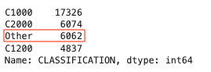
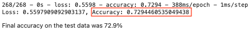
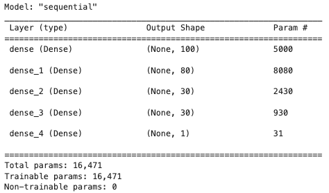

# Report on the Neural Network Model: Charity Funding Predictor

## Overview of the analysis: 
The nonprofit foundation Alphabet Soup wants a tool that can help it select the applicants for funding with the best chance of success in their ventures. To do this, I used the features in the provided dataset to create a binary classifier that can predict whether applicants will be successful if funded by Alphabet Soup.

## Results:

### Data Preprocessing

- **What variable(s) are the target(s) for your model?**
    
    * I used the binary variable "IS_SUCCESSFUL" as the target for my model. This meant the model would be predicting whether or not the money was used successfully.
        
- **What variable(s) are the features for your model?**
    
    * The variables I used as features for my model were: APPLICATION_TYPE, AFFILIATION, CLASSIFICATION, USE_CASE, ORGANIZATION, STATUS, INCOME_AMT, SPECIAL_CONSIDERATIONS,and ASK_AMT. 
    
    * As some of these were categorical variables, the complete list of features after using pd.get_dummies() to encode categorical variables was: 
       'STATUS', 'ASK_AMT', 'APPLICATION_TYPE_Other', 'APPLICATION_TYPE_T10',
       'APPLICATION_TYPE_T19', 'APPLICATION_TYPE_T3', 'APPLICATION_TYPE_T4',
       'APPLICATION_TYPE_T5', 'APPLICATION_TYPE_T6', 'APPLICATION_TYPE_T7',
       'APPLICATION_TYPE_T8', 'AFFILIATION_CompanySponsored',
       'AFFILIATION_Family/Parent', 'AFFILIATION_Independent',
       'AFFILIATION_National', 'AFFILIATION_Other', 'AFFILIATION_Regional',
       'CLASSIFICATION_C1000', 'CLASSIFICATION_C1200', 'CLASSIFICATION_C1270',
       'CLASSIFICATION_C1700', 'CLASSIFICATION_C2000', 'CLASSIFICATION_C2100',
       'CLASSIFICATION_C2700', 'CLASSIFICATION_C3000', 'CLASSIFICATION_C4000',
       'CLASSIFICATION_C5000', 'CLASSIFICATION_C7000', 'CLASSIFICATION_Other',
       'USE_CASE_CommunityServ', 'USE_CASE_Heathcare', 'USE_CASE_Other',
       'USE_CASE_Preservation', 'USE_CASE_ProductDev',
       'ORGANIZATION_Association', 'ORGANIZATION_Co-operative',
       'ORGANIZATION_Corporation', 'ORGANIZATION_Trust', 'INCOME_AMT_0',
       'INCOME_AMT_1-9999', 'INCOME_AMT_10000-24999',
       'INCOME_AMT_100000-499999', 'INCOME_AMT_10M-50M', 'INCOME_AMT_1M-5M',
       'INCOME_AMT_25000-99999', 'INCOME_AMT_50M+', 'INCOME_AMT_5M-10M',
       'SPECIAL_CONSIDERATIONS_N', 'SPECIAL_CONSIDERATIONS_Y'
       
- **What variable(s) should be removed from the input data because they are neither targets nor features?**
    
    * I removed the variables 'EIN' and 'NAME' from the input data, as they were identification values that would have no meaninful impact on the model.

### Compiling, Training, and Evaluating the Model

#### How many neurons, layers, and activation functions did you select for your neural network model, and why?
    
- My first model used two hidden layers, one with 80 neurons and the second with 30. Both used the ReLu activation function. My output layer  used the Sigmoid activation function. I chose this setup to match the outputs included in the starter code as a starting place.
    
- For the final version of my model, I used
    - Four layers
    - 100 neurons in the first layer, 80 in the second and 30 neurons in each of the last two layers
    - ReLu and tanh activation functions (I only used tanh for the second hidden layer). I used the Sigmoid activation function for the output layer.
    - I chose this setup after some trial and error in my other model optimization attemps. The model where I increased the number of layers and changed the activation functions let to slightly increased accuracy scores.

#### Were you able to achieve the target model performance?
    
- I was not able to achieve the target model performance of 75%. The closest my models got was a predictive accuracy of 73%.

#### What steps did you take in your attempts to increase model performance?
    
- My **original model** achieved an accuracy score of 72.9%  
    
    
- **Attempt #1:**
        
    - In my first attempt at optimization, I thought reducing the number of features might improve accuracy, so I raised the cutoff points for the "other" bin in the 'APPLICATION_TYPE' and 'CLASSIFICATION' columns.    
            
            
        This change reduced the number of features from 43 to 38. I kept the setup of my model the same, but this yielded a slightly lower accuracy score of 72.6%.    
        
    
- **Attempt #2:**
        
    - Since the decrease in number of features had led to a slight decrease in accuracy, I returned to the original number of features in my second model attempt. In this version, I thought that adding more hidden layers could increase the model's ability to deal with complexities and could therefore increase accuracy. I added a third and fourth hidden layer, keeping the same activation function and number of neurons as I had used for the second hidden layer.  
          
        This model ended up with a basically identical accuracy score as what came out of my original model (72.9%).
        
    
- **Attempt #3:**
        
    - In my final attempt, I used the same cutoff points for the "other" bin in the 'APPLICATION_TYPE' column, but lowered the cutoff point for the 'CLASSIFICATION' column.  
        
    This increased the number of features to 49. I kept the four hidden layers used in Attempt #2, but increased the first layer's neurons to 100, changed the second layer's activation function to tanh, and increased that layer's neurons to 80.  
     
    This led to a slight increase to 73% accuracy.   
    

## Summary: 

The deep learning model was moderately successful in predicting the target ("IS_SUCCESSFUL"). Despite several modifications, I was not able to get my model to the requested 75% accuracy score.

Adding layers did not seem to meaningfully impact the model, but the accuracy score did go down when I decreased the number of features. Perhaps decreasing the "other" bins even more would continue to raise the accuracy score. I would also be interested in seeing how a random forest model might handle this data, given that much of it is categorical.
